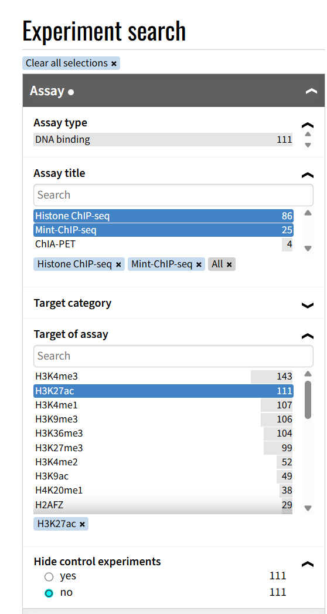
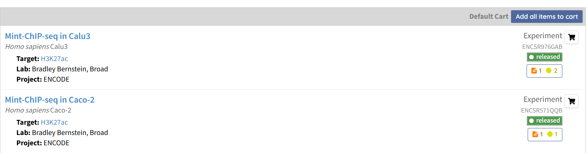
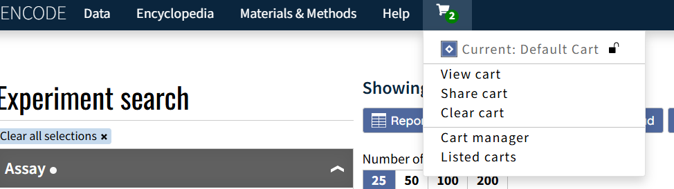
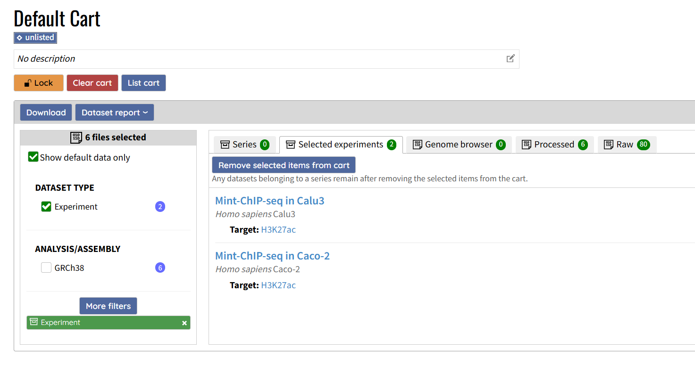
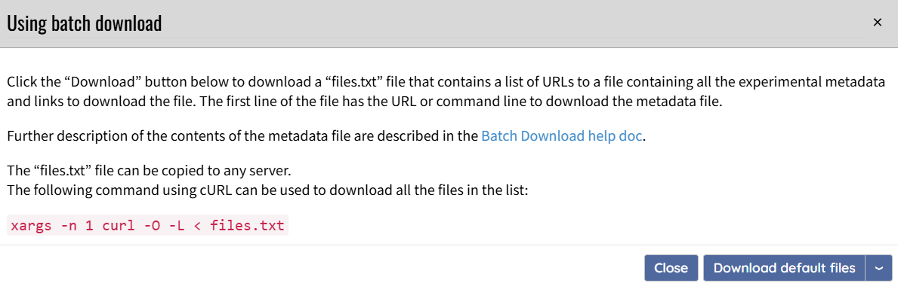

## **How to Batch Download ENCODE Data**

##### Use the filters to select the experiments you need.



##### Click the shopping cart icon on the right to add the desired experiments to the cart.



##### Click **View Cart**.



##### In **DATASET TYPE**, check **experiment**, otherwise you will not be able to download. 



##### After selecting the file types you need, click **Download**. Save the `files.txt` file. Then enter the following command in the terminal to start downloading:



```
xargs -n 1 curl -O -L < files.txt
```

##### **Tip:** The downloaded `.bigBed` files can be converted into `.bed` files.

