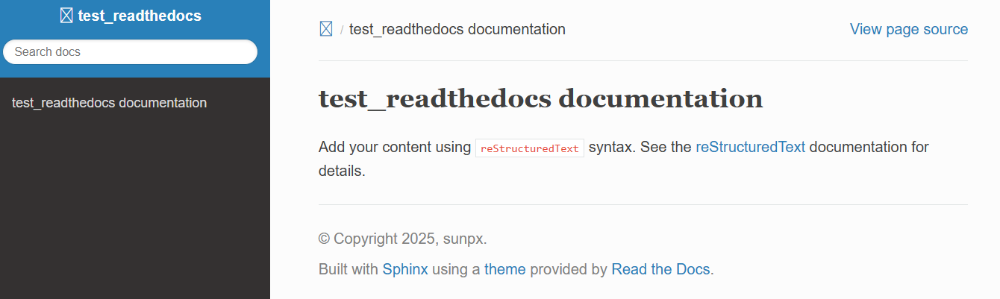
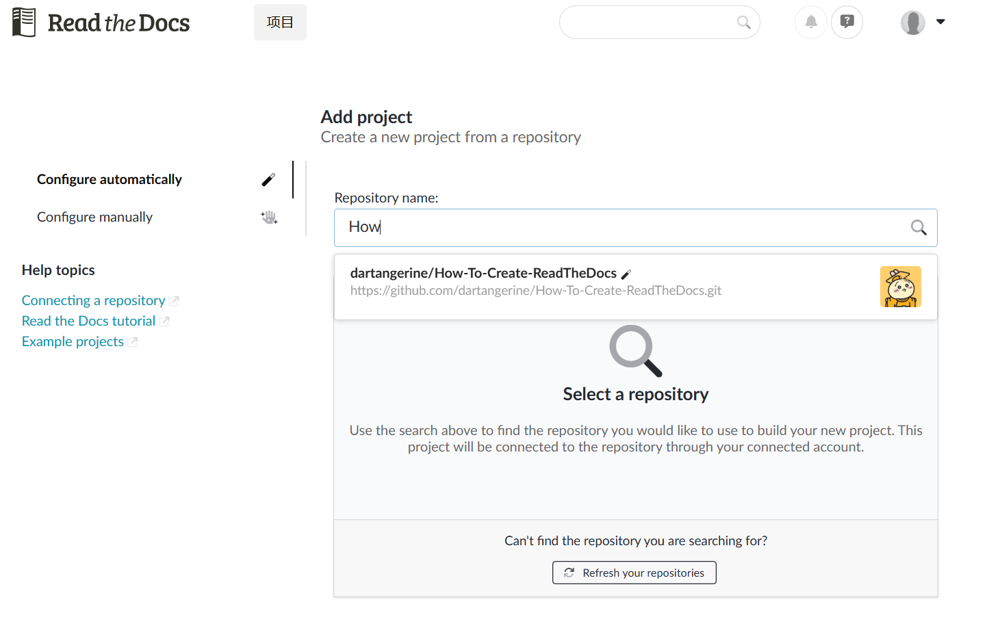

# Create document by Readthedocs

**This page is based on JiankangWang‘s version**

Read the Docs is an open-source platform for hosting and building project documentation. It automatically generates and updates docs from files in version control repositories (like GitHub).

In this page, I will show you how to use Readthedocs to make a online document for your software; package; or any other things.

Here is a quick start:

## 1. Sphinx

> Sphinx is a powerful documentation generator that has many great features for writing technical documentation

First, make sure we have installed `Sphinx`

 ```shell
pip install sphinx
pip install sphinx_rtd_theme  #download readthedocs theme
 ```

Second, create the folder:

```
mkdir rtd_test
cd rtd_test
```

Then, start the sphinx project:

```shell
sphinx-quickstart
```

Type your choose:

```shell
> Separate source and build directories (y/n) [n]: y
> Project name: rtd_test
> Author name(s): me
> Project release []: 0.0.1
> Project language [en]: en
```

Now, the folder structure should be:

```
test_readthedocs
├── Makefile
├── build
├── make.bat
└── source
    ├── _static
    ├── _templates
    ├── conf.py
    └── index.rst
```

## 2. Write some test file

> **reStructuredText** (**RST**, **ReST**, or **reST**) is a file format for textual data used primarily in the Python programming language community for technical documentation

> reStructuredText (.rst) is the preferred format for technical documentation than markdown(.md), see [Why You Shouldn’t Use “Markdown” for Documentation](https://www.ericholscher.com/blog/2016/mar/15/dont-use-markdown-for-technical-docs/)

For example:

```rst
Section Header
==============

Subsection Header
-----------------
```

Now we create `hello.rst` in `source` folder:

```
hello,world
=============
test the rst
```

and modify `index.rst` to:

```rst
.. toctree::
   :maxdepth: 2
   :caption: Contents:

   hello   #Name of your rst file
```

Then, back to the `test_readthedocs` folder, run:

```shell
make html
```

## 3. Use the RTD(ReadTheDocs) theme

Find `source/conf.py` and modify the line `html_theme = 'alabaster'` to

```python
import sphinx_rtd_theme
html_theme = "sphinx_rtd_theme"
```

Back to the `test_readthedocs` folder and re-run:

```shell
make html
```

Now, you can open `build/html/index`  in a browser, and see:

  

## 4. Use Markdown (instead of rst) with sphinx

- Some people still prefer the markdown style.
- A package `recommonmark` let us directly use markdown in sphinx.

Step1, install it:

```python
pip install recommonmark
```

Step2, modify the `test_readthedocs/source/conf.py` :

```python
# for Sphinx-1.4 or newer
extensions = ['recommonmark']

# for Sphinx-1.3
from recommonmark.parser import CommonMarkParser

source_parsers = {
    '.md': CommonMarkParser,
}

source_suffix = ['.rst', '.md']
```

By these two step, now we can directly use markdown file. For example, create a markdown file `testMarkdown.md` in `test_readthedocs/source/`, and write: 

```
# Hello, markdown

## something
```

Then, modify `index.rst` to:

```python
.. toctree::
   :maxdepth: 2
   :caption: Contents:

   hello
   testMarkdown
```

## 5. Publish to ReadTheDocs

### 5.1 Create `.readthedocs.yaml` file

Create a `.readthedocs.yaml` file under `test_readthedocs` folder, and write in the following content:

```yaml
# Read the Docs configuration file
# See https://docs.readthedocs.io/en/stable/config-file/v2.html for details

# Required
version: 2

# Set the OS, Python version, and other tools you might need
build:
  os: ubuntu-24.04
  tools:
    python: "3.13"

# Build documentation in the "docs/" directory with Sphinx
sphinx:
   configuration: source/conf.py

# Optionally, but recommended,
# declare the Python requirements required to build your documentation
# See https://docs.readthedocs.io/en/stable/guides/reproducible-builds.html
python:
    install:
    - requirements: source/requirements.txt
        

```

### 5.2 Create `requirements.txt` file

Create a `requirements.txt` file under `test_readthedocs` folder, and write in the following content:

```
recommonmark
sphinx_rtd_theme
myst-parser
```

### 5.3 Push our project to GitHub.

First, create a new repository on GitHub and copy the ssh link.

<div style="padding: 15px; border: 1px solid transparent; border-color: transparent; margin-bottom: 20px; border-radius: 4px; color: #8a6d3b;; background-color: #fcf8e3; border-color: #faebcc;">
The repository must be public (not private)
</div>

<div style="padding: 15px; border: 1px solid transparent; border-color: transparent; margin-bottom: 20px; border-radius: 4px; color: white;; background-color: #e17055; border-color: #faebcc;">
Nowadays, SSH connection is the more recommended way to connect to GitHub.
Make sure you have generated an SSH key pair and submitted the public key to GitHub.
</div>

Then, in the `test_readthedocs` folder of your local PC, create a `.gitignore` file and write:

```
build/
```

because we don't need to push the `build` folder.

Then, create a github repository, and copy its ssh link.

Then, run the following codes:

```shell
git init
git remote -v
git remote add origin git@github.com:dartangerine/How-To-Create-ReadTheDocs.git
#change it to your github repository ssh link
git add .
git commit -m "push_to_github"
git push -u origin master
```

The project is already on GitHub.

### 5.4 Link to ReadTheDocs

- Register account on https://readthedocs.org

- Login and linking your GitHub account to your ReadTheDocs account

- Click 'Add project' green button

  

- Type in your  readthedocs repository name to search it, and choose it. 

  

- Click "Continue" --> "Continue"-->"This file exists"

- Now the document is online!

### 5.5 Update the document

One wonderful advantage of "Github + ReadTheDocs", is the easy way to update.

- modify the document (`hello.rst`, `testMarkdown.md`, et.al) in your local PC.

- Push to github

  ```shell
  git add .
  git commit -m "modify something"
  git push
  ```

- ReadtheDocs will automatically update your online document

### 5.6 Figure

- The figure used in the document could be stored in `test_readthedocs/source/_static` 

- For example, I have `test_readthedocs/source/_static/RTDimport.png` .So when document `test_readthedocs/source/test.md` can use the figure by:

  ```html
  
  ```

